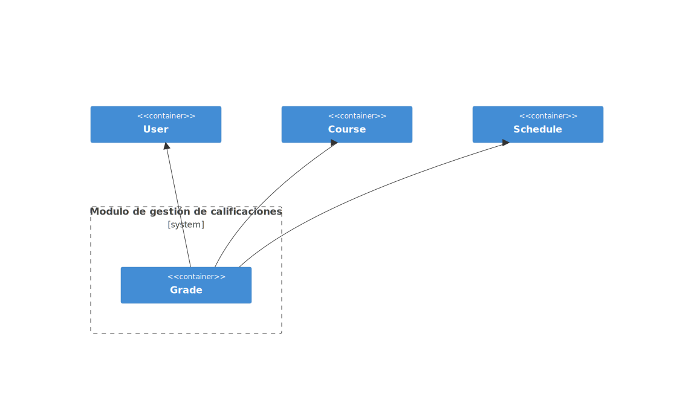
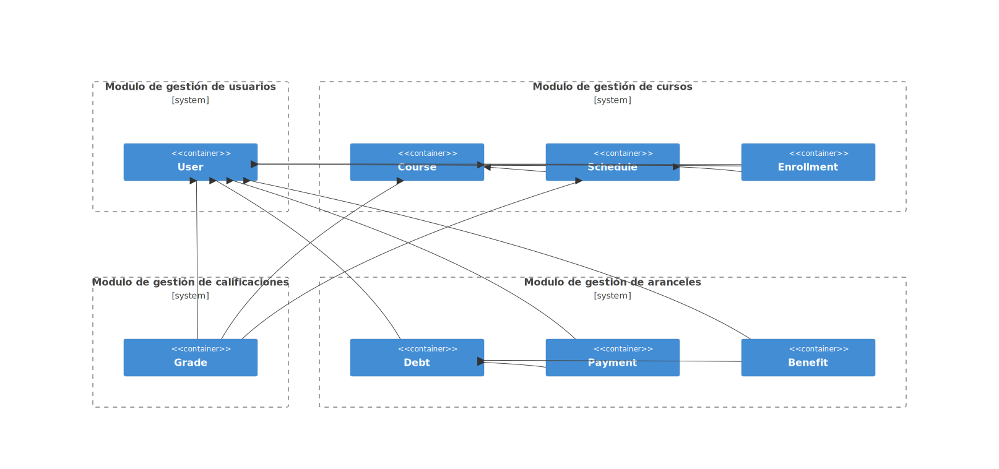

<!-- marp: true -->
<!-- theme: uncover -->
<!-- class: invert -->
<!-- paginate: true -->
<!-- footer: Microservicios por Rafik Mas'ad Nasra -->
<!-- author: Rafik Mas'ad Nasra -->
<!-- title: Comunicación entre servicios -->
<!-- size: 16:9 -->

## Sistemas de Gestión Académica Universitario - Módulo Calificaciones

---

### Contexto

Este proyecto técnico está diseñado para gestionar de manera eficiente los sistemas académicos de una universidad. Incluye funcionalidades para la administración de estudiantes, profesores, cursos, inscripción, calificaciones y pago de arancel.

---

Las características clave del sistema incluyen:

- **Gestión de estudiantes, profesores y administrativos**: Registro y seguimiento de la información personal y académica de los miembros de la comunidad universitaria.
- **Gestión de cursos**: Creación y administración de cursos, incluyendo horarios, asignación de profesores e inscripción de estudiantes.
- **Gestión de calificaciones**: Registro y seguimiento de las calificaciones de los estudiantes.

- **Gestión de aranceles**: Registro y seguimiento de los aranceles, deuda y pagos de aranceles de los estudiantes.

---

Esta plataforma será construida en microservicios ya que permite una mayor flexibilidad y escalabilidad en el desarrollo y mantenimiento del sistema.

Además, esta plataforma tiene que ser altamente disponible y tolerante a fallos, por lo que la arquitectura de microservicios es la más adecuada para este proyecto.

En periodo de inscripción, la plataforma debe ser capaz de manejar un alto volumen de transacciones simultáneas.

---

## Glosario (lenguaje ubicuo)

- **Estudiante**: Persona que se encuentra inscrita en la universidad.
- **Profesor**: Persona que imparte clases en la universidad.
- **Administrativo**: Persona que trabaja en la universidad en labores administrativas.
- **Curso**: Asignatura que se imparte en la universidad.
--- 
- **Arancel**: Pago que los estudiantes deben realizar para cursar un semestre.
- **Beneficio**: Descuento o ayuda económica otorgada a los estudiantes. Puede ser una beca o un crédito.
- **Calificación**: Nota obtenida por un estudiante en un curso.
- **Deuda**: Monto pendiente de pago por parte de un estudiante.
- **Pago**: Monto abonado por un estudiante para saldar su deuda.

---

## Modulo de gestión de calificaciones

---

### Diagrama de arquitectura
---

<!-- _class: default -->

---

### Requerimientos

- **Registrar una calificación**: El sistema debe permitir registrar una calificación para un estudiante en un curso.
- **Actualizar una calificación**: El sistema debe permitir actualizar una calificación.
- **Eliminar una calificación**: El sistema debe permitir eliminar una calificación. Esta acción debe ser reversible.
---

- **Consultar información de una calificación**: El sistema debe permitir consultar la información de una calificación.
- **Listar todas las calificaciones de un estudiante**: El sistema debe permitir listar todas las calificaciones de un estudiante. Con paginación y filtros.
- **Listar todas las calificaciones de un curso**: El sistema debe permitir listar todas las calificaciones de un curso. Con paginación y filtros.
---
- **Listar todas las calificaciones de un paralelo**: El sistema debe permitir listar todas las calificaciones de un paralelo. Con paginación y filtros.

---

### Listado de puntos de comunicación de calificaciones

Request por API REST:
- **Registrar una calificación**: `POST /api/v1/{course_id}/grades`
- **Actualizar una calificación**: `PUT /api/v1/{course_id}/grades/{grade_id}`
---

- **Eliminar una calificación**: `DELETE /api/v1/{course_id}/grades/{grade_id}`
- **Consultar información de una calificación**: `GET /api/v1/{course_id}/grades/{grade_id}`
- **Listar todas las calificaciones de un estudiante**: `GET /api/v1/{student_id}/grades`
---
- **Listar todas las calificaciones de un curso**: `GET /api/v1/{course_id}/grades`
- **Listar todas las calificaciones de un paralelo**: `GET /api/v1/{course_id}/parallels/{parallel_id}/grades`

---

Mensajes (eventos/event-driven):

- **Registro de una calificación**: `grade.{id}.created`
- **Actualización de una calificación**: `grade.{id}.updated`
- **Eliminación de una calificación**: `grade.{id}.deleted`

---
## Diagrama de arquitectura general

---

<!-- _class: default -->

---

---

